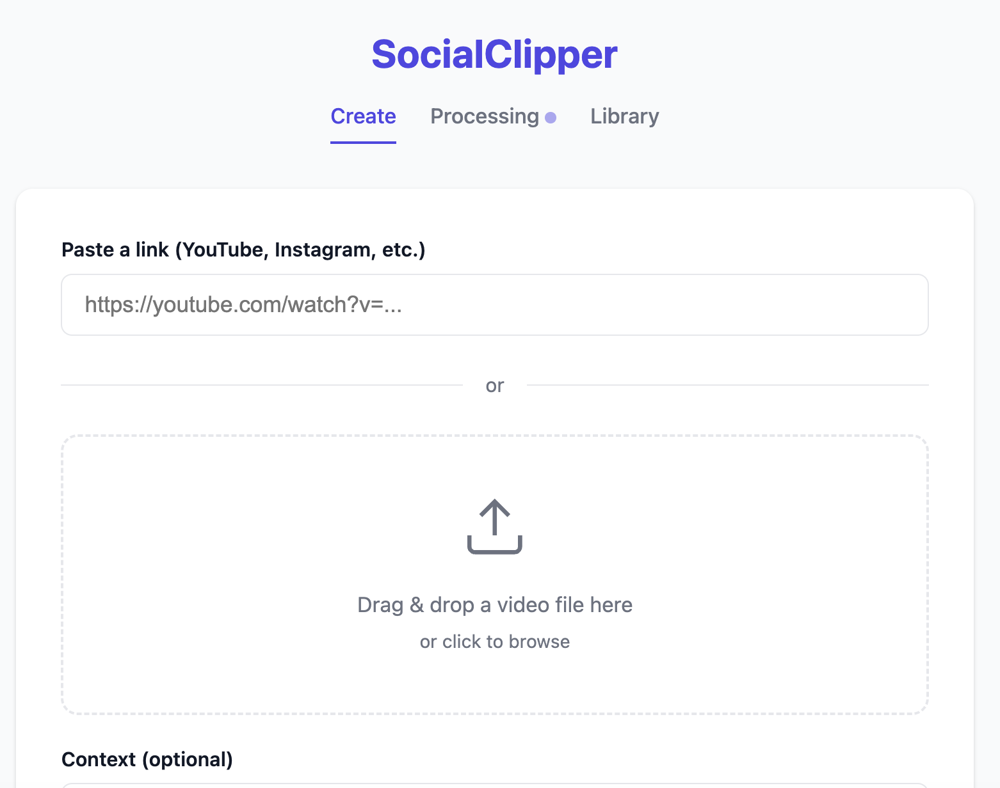
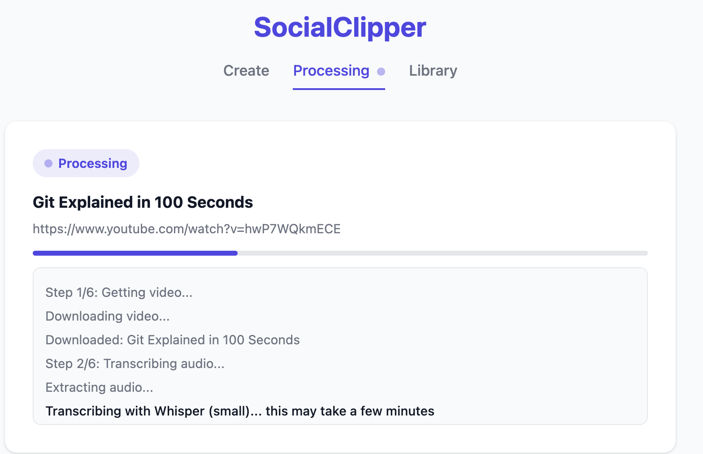

# SocialClipper

AI-powered video-to-social-clips pipeline. Drop in a video (or paste a YouTube URL), and SocialClipper will:

1. **Transcribe** it locally using [MLX Whisper](https://github.com/ml-explore/mlx-examples/tree/main/whisper) (Apple Silicon optimized)
2. **Analyze** the transcript with Claude to find the best clip-worthy moments
3. **Extract** video clips with ffmpeg, formatted for each platform (LinkedIn 16:9, Instagram Reels 9:16)
4. **Draft** publish-ready social media posts in the speaker's voice
5. **Serve** everything in a clean web UI with a library of past runs

## Screenshots





## Requirements

- **macOS** with Apple Silicon (M1/M2/M3/M4) — MLX Whisper requires it
- **Python 3.12+**
- **ffmpeg** — for video processing
- **yt-dlp** — for downloading videos from URLs
- **Anthropic API key** — for Claude-powered analysis and drafting

> **Warning:** Never commit your API key! Copy `.env.example` to `.env` and add your key there. The `.env` file is gitignored.

> **Apple Silicon required.** MLX Whisper only runs on Macs with M1/M2/M3/M4 chips.

## Quick Start

```bash
# 1. Clone the repo
git clone https://github.com/Shlomog/socialclipper.git
cd socialclipper

# 2. Run the installer (installs ffmpeg, yt-dlp, Python deps)
chmod +x install.sh
./install.sh

# 3. Set your API key (copy .env.example to .env and fill in your key)
cp .env.example .env
# Edit .env and add your Anthropic API key

# 4. Start the server
./run.sh

# 5. Open http://localhost:8000
```

## How It Works

### Pipeline

```
Video/URL → Transcribe (Whisper) → Analyze (Claude) → Draft Posts (Claude) → Extract Clips (ffmpeg)
```

Each run produces:
- `clips/` — MP4 files formatted per platform
- `analysis.json` — Claude's clip recommendations with timestamps
- `transcript.json` — Full timestamped transcript
- `drafts.md` — Ready-to-post social media copy

### Web UI

- **Create** — Paste a URL or upload a video file. Optionally add context.
- **Processing** — Watch progress in real-time via SSE.
- **Library** — Browse all past runs, play clips, copy drafts, and re-edit clips with trim/crop controls.

### Clip Editing

The library includes a built-in editor where you can:
- Trim start/end times with a visual timeline
- Switch aspect ratios (16:9, 1:1, 9:16)
- Adjust crop position for aspect ratio conversions

## Configuration

### Voice & Brand

Edit `src/socialclipper/config.py` to customize:

- **`VOICE_SYSTEM_PROMPT`** — The writing style and voice rules for draft generation
- **`ANALYSIS_SYSTEM_PROMPT`** — What Claude looks for when selecting clip moments
- **`BRAND_PILLARS`** — Your brand categories (default: Thought Leadership, Innovation, Authenticity)
- **`CONTENT_TYPES`** — Content categories (default: Authority, Story, Commentary, Connection)

### Claude Model

The default model is `claude-sonnet-4-20250514`. Change `CLAUDE_MODEL` in `config.py` to use a different model.

### Platform Specs

Platform video specs (resolution, duration limits, draft length) are configured in `PLATFORM_SPECS` in `config.py`. Currently supports LinkedIn and Instagram Reels.

## Project Structure

```
socialclipper/
├── src/socialclipper/
│   ├── app.py          # FastAPI server + API routes
│   ├── pipeline.py     # Main orchestration pipeline
│   ├── transcriber.py  # MLX Whisper transcription
│   ├── analyzer.py     # Claude transcript analysis
│   ├── drafter.py      # Claude draft generation
│   ├── clipper.py      # ffmpeg clip extraction
│   ├── output.py       # Output folder + markdown rendering
│   └── config.py       # All configuration (voice, platforms, prompts)
├── static/             # Web UI (HTML, CSS, JS)
├── install.sh          # One-command setup
├── run.sh              # Start the server
└── pyproject.toml
```

## License

MIT
